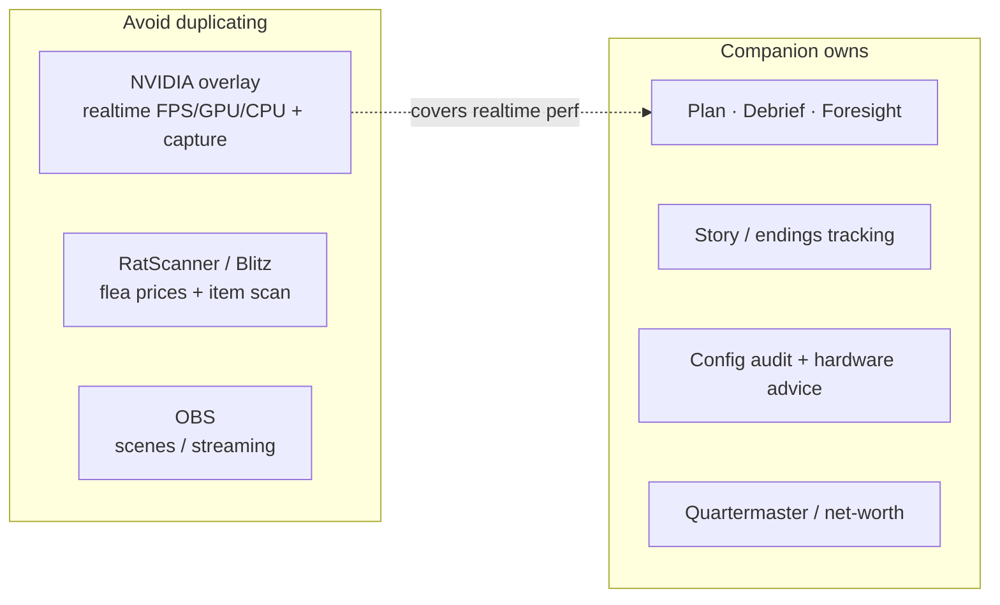
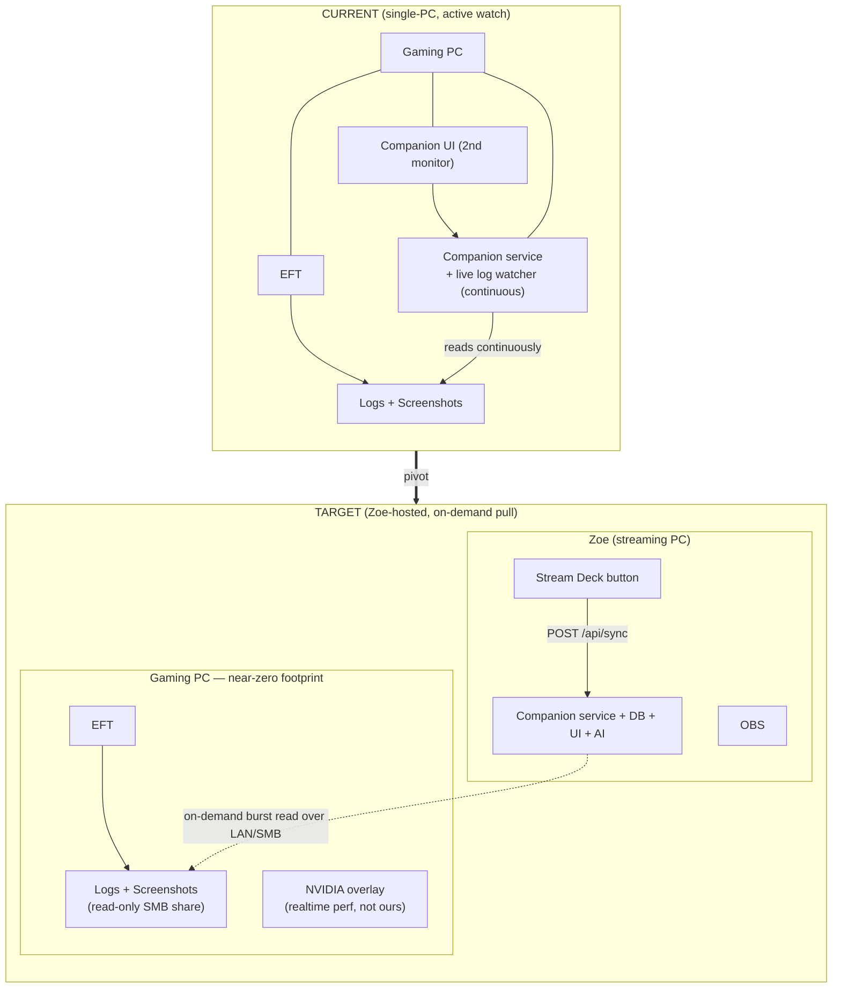
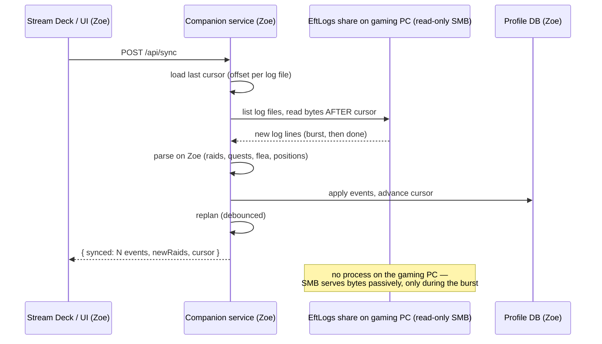

# Two-PC Architecture — Companion on the Streaming PC (pull model)

> Planning + decision scaffold for the pivot Kaden set on 2026-07-19. Nothing
> here is built yet except where noted ("✅ exists"). Diagrams render on GitHub
> and in Artifacts. This doc is the place to argue the decisions before code.

## Principles (the new hard constraints)

1. **Zero footprint on the gaming PC.** No active process of ours, no continuous
   polling, nothing that costs a single frame. Performance-of-the-game wins over
   convenience-of-the-app, every time.
2. **The Companion runs on the streaming PC (`Zoe`), same wired LAN.** That's
   where the UI, service, DB, and any AI live — next to OBS and the Stream Deck,
   like the old setup.
3. **Log access is on-demand (pull), never continuous.** A **"Sync logs"** action
   (UI button _and_ a Stream Deck button) reads the gaming PC's Tarkov logs in a
   burst, then stops. No watcher sitting on the gaming PC's disk.
4. **Minimize surfaces — don't rebuild tools Kaden already runs.**
   - Realtime FPS/GPU/CPU metrics + clip capture → **NVIDIA overlay** (already on the gaming PC).
   - Live flea prices / item scan → **RatScanner / Blitz** (not our job; low interest).
   - Streaming/scenes → **OBS**.
   - Ours = **progression coaching, planning, debrief, story, config/audit** — the analysis layer no one else owns.

## Consequence: what the Companion *is* in this model

Running on `Zoe`, the Companion cannot meaningfully read the **gaming PC's**
live hardware — any telemetry it samples is `Zoe`'s. So realtime perf monitoring
is delegated to the NVIDIA overlay, and the live **bottleneck / thermal** reads
(built this session) are only meaningful if the Companion is ever run *on the
gaming PC*. In the Zoe-hosted target they move to the background; the Companion's
job is **coach + tracker + planner**, fed by on-demand log syncs.



## Topology: current → target



## The "Sync logs" pull flow

The gaming PC exposes its Tarkov `Logs` (and optionally `Screenshots`) as a
**read-only SMB share** — a passive, kernel-level Windows feature with no process
and no measurable cost. `Zoe` reads new content only when triggered, tracks a
cursor so each sync only pulls what's new, and does **all parsing on `Zoe`**.



## Key decisions (forks — pick before building)

| # | Decision | Options | Recommendation |
|---|----------|---------|----------------|
| **D1** | How does Zoe reach the gaming PC's logs? | **A.** Read-only SMB share (native, zero process). **B.** Tiny pull-agent on gaming PC (has footprint). **C.** TarkovTracker cloud for progress + SMB only for what TT lacks. | **A** for logs (honors zero-footprint); lean on **C**'s TT mirror for progress where it already works, so a sync is only needed for perf/positions/detail TT doesn't carry. |
| **D2** | Sync trigger | Manual UI button; Stream Deck button (HTTP); auto-on-app-focus; scheduled. | **Manual button + Stream Deck**, never scheduled/continuous (that's polling). Optionally "sync when TarkovTracker reports a new raid" later — still event-driven, not polling. |
| **D3** | What a sync pulls | Logs only; logs + screenshots (positions); logs + perf CSVs. | **Logs + screenshots** (positions are cheap and useful); skip perf CSVs (NVIDIA overlay owns realtime). |
| **D4** | Gaming-PC-side perf features | Keep live bottleneck/thermal; drop them; make them "only when run on the gaming PC". | **Keep the code, gate the UI**: show live telemetry/bottleneck/thermal only when the service is running on the same PC as EFT; otherwise hide (NVIDIA overlay covers Zoe-vs-game). |
| **D5** | Stream Deck integration | System "Website/URL" button → `POST /api/sync`; a small custom plugin; multi-action. | Start with a **URL/HTTP button** to `POST http://zoe:3141/api/sync` (zero build); consider a tiny plugin later for status/feedback on the key. |
| **D6** | Cross-PC networking | (✅ built) opt-in LAN exposure. | Add `Zoe` to `config.lan.allowHosts`; bind LAN on Zoe. Trusted home LAN, no auth. |

## What already exists that supports this

- ✅ **Opt-in LAN exposure** (`config.lan{enabled,allowHosts}` / `TAC_BIND_LAN`) — the service can bind the LAN with a Host allowlist. Add `zoe` + Zoe's LAN IP.
- ✅ **TarkovTracker read-mirror** — pulls progress from the TT cloud without touching the gaming PC at all (the ideal zero-footprint progress source).
- ✅ **Env-configurable paths** (`TAC_EFT_PATH`, `TAC_SNAPSHOT_DIR`, …) — the service can be pointed at a UNC path (`\\GAMINGPC\EftLogs`) instead of a local dir.
- ✅ **Installer** runs anywhere — installing on `Zoe` is just running the same `.exe` there.

## What needs building (once decisions land)

1. **Pull-sync mode** — a flag that **disables the continuous watcher** and instead exposes an on-demand sync: read each log file from a stored byte-cursor over SMB/UNC, parse on Zoe, advance the cursor. (Reuses the existing log parsers; only the *trigger* changes from "watch" to "pull".)
2. **`POST /api/sync`** endpoint returning a summary (events applied, new raids, cursor), + a **"Sync logs" button** in the UI header with last-synced time.
3. **Config**: `sync.mode = "watch" | "pull"`, `sync.source` (UNC path or TT-only), Zoe hostname in the LAN allowlist.
4. **Stream Deck doc** — how to bind a key to `POST /api/sync` (and later, optional status feedback).
5. **UI gating (D4)** — hide same-PC-only perf panels when running remote.

## Open questions for Kaden

- **D1**: read-only SMB share OK, or do you want to avoid sharing a folder (→ we'd need a tiny agent, which has *some* footprint)?
- Where does **TarkovMonitor** run in the new setup? It also reads logs → we should not double-own the log path. If TM stays on the gaming PC feeding TarkovTracker, the Companion on Zoe may only need the **TT cloud sync** for progress and SMB purely for extras (positions, anything TT lacks).
- Positions/screenshots on Zoe — **wanted**, or logs-only to keep the share minimal?
- Stream Deck — happy starting with a plain URL button, or do you want a dedicated plugin with status on the key?
```
