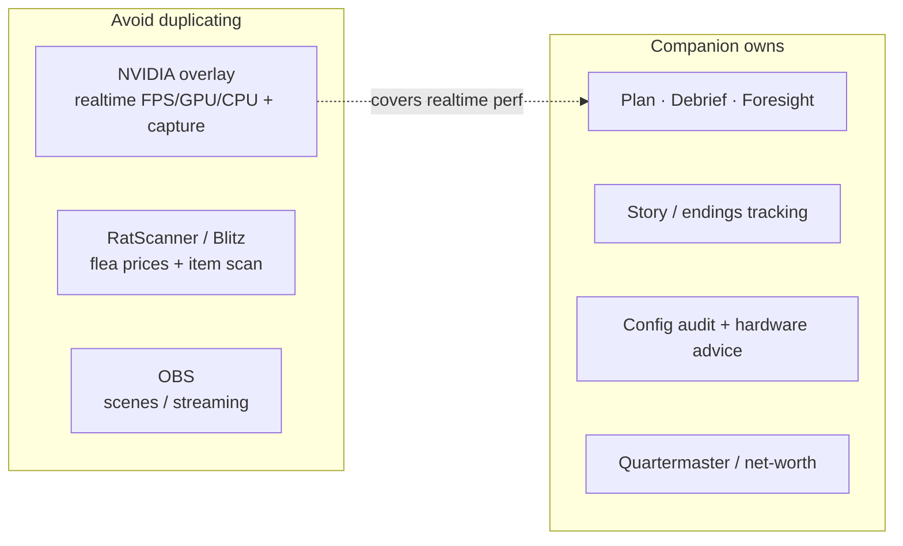
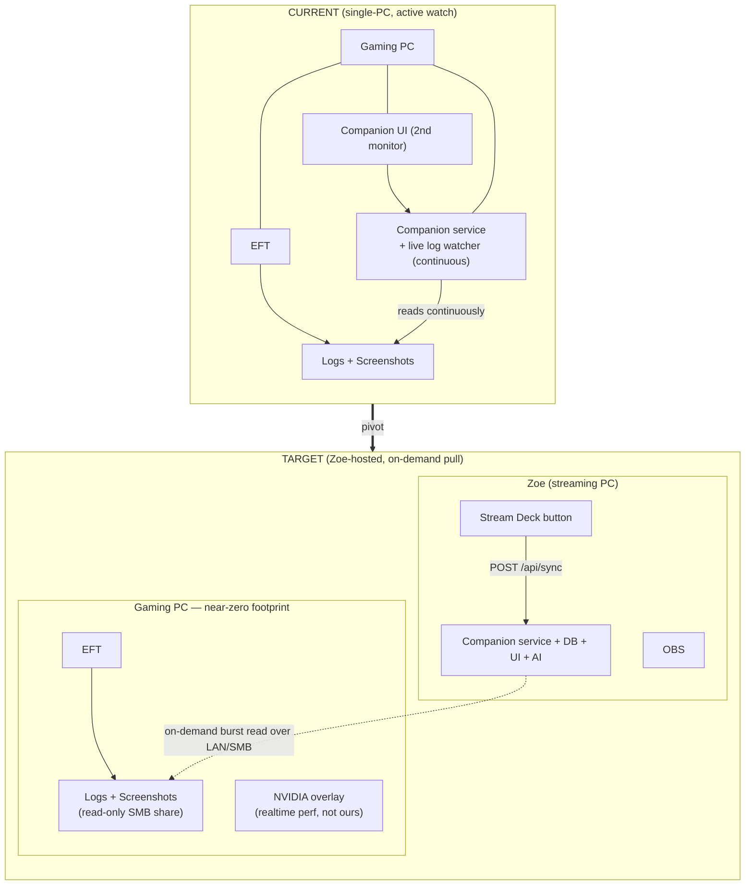
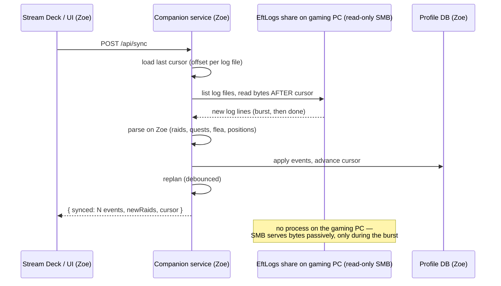

# Two-PC Architecture — Companion on the Streaming PC (pull model)

> Planning + decision scaffold for the pivot Kaden set on 2026-07-19. Diagrams
> render on GitHub and in Artifacts.

## Status (2026-07-19)

**Decisions locked** (from Kaden): gaming PC = **`hero`**, streaming PC = **`Zoe`**,
same **Tailscale** tailnet with `hero`'s `C:\` shared to every device. **D1** =
read `hero`'s shared `Logs` over Tailscale (no agent). **D3** = **logs only** (no
positions/screenshots). **D5** = Stream Deck on Zoe; fancy icon page is "later".

**✅ Built** (`b496c0f`): on-demand pull sync — `POST /api/sync` drives one
cursor-based read of the configured logs dir and reports a summary; a **"⟲ Sync
logs"** button in the HUD; `TAC_LOGS_DIR` / `config.logsDir` point at `hero`'s
share; with the continuous watcher off there is **no background polling**. See
"Setup on Zoe" at the bottom.

### TarkovMonitor — the "anything counterintuitive?" question

You have TarkovMonitor on `hero` **and** a second one on `Zoe` watching `hero`'s
shared Logs. Two things to know:

1. **Don't run two TMs against the same TarkovTracker account.** Both would push
   to TT, double-spending its shared **100 writes/day** and racing each other's
   state — the exact contention our read-mostly stance avoids. Pick **one** TM as
   the TT writer (either the `hero` one, or the `Zoe`-watching-`hero` one — not
   both). This is separate from our Companion, which only **reads** logs.
2. **TM watches continuously.** A remote `FileSystemWatcher` over SMB either gets
   change notifications or silently falls back to polling the share — either way
   it's a steady trickle of network reads while TM runs. It won't hurt `hero`'s
   FPS meaningfully (SMB serving is cheap), but it's not "nothing". **Our** sync
   is deliberately different: **on-demand only**, so between button presses there
   is zero traffic. If you keep a TM on Zoe for TT, that's fine — just know our
   Companion doesn't add any continuous load on top.

Net: keep **one** TM as your TarkovTracker writer; let the Companion pull logs
on demand for the coaching/planning it owns.

## Principles (the new hard constraints)

1. **Zero footprint on the gaming PC.** No active process of ours, no continuous
   polling, nothing that costs a single frame. Performance-of-the-game wins over
   convenience-of-the-app, every time.
2. **The Companion runs on the streaming PC (`Zoe`), same wired LAN.** That's
   where the UI, service, DB, and any AI live — next to OBS and the Stream Deck,
   like the old setup.
3. **Log access is on-demand (pull), never continuous.** A **"Sync logs"** action
   (UI button _and_ a Stream Deck button) reads the gaming PC's Tarkov logs in a
   burst, then stops. No watcher sitting on the gaming PC's disk.
4. **Minimize surfaces — don't rebuild tools Kaden already runs.**
   - Realtime FPS/GPU/CPU metrics + clip capture → **NVIDIA overlay** (already on the gaming PC).
   - Live flea prices / item scan → **RatScanner / Blitz** (not our job; low interest).
   - Streaming/scenes → **OBS**.
   - Ours = **progression coaching, planning, debrief, story, config/audit** — the analysis layer no one else owns.

## Consequence: what the Companion *is* in this model

Running on `Zoe`, the Companion cannot meaningfully read the **gaming PC's**
live hardware — any telemetry it samples is `Zoe`'s. So realtime perf monitoring
is delegated to the NVIDIA overlay, and the live **bottleneck / thermal** reads
(built this session) are only meaningful if the Companion is ever run *on the
gaming PC*. In the Zoe-hosted target they move to the background; the Companion's
job is **coach + tracker + planner**, fed by on-demand log syncs.

## Topology: current → target

## The "Sync logs" pull flow

The gaming PC exposes its Tarkov `Logs` (and optionally `Screenshots`) as a
**read-only SMB share** — a passive, kernel-level Windows feature with no process
and no measurable cost. `Zoe` reads new content only when triggered, tracks a
cursor so each sync only pulls what's new, and does **all parsing on `Zoe`**.

## Key decisions (forks — pick before building)

| # | Decision | Options | Recommendation |
|---|----------|---------|----------------|
| **D1** | How does Zoe reach the gaming PC's logs? | **A.** Read-only SMB share (native, zero process). **B.** Tiny pull-agent on gaming PC (has footprint). **C.** TarkovTracker cloud for progress + SMB only for what TT lacks. | **A** for logs (honors zero-footprint); lean on **C**'s TT mirror for progress where it already works, so a sync is only needed for perf/positions/detail TT doesn't carry. |
| **D2** | Sync trigger | Manual UI button; Stream Deck button (HTTP); auto-on-app-focus; scheduled. | **Manual button + Stream Deck**, never scheduled/continuous (that's polling). Optionally "sync when TarkovTracker reports a new raid" later — still event-driven, not polling. |
| **D3** | What a sync pulls | Logs only; logs + screenshots (positions); logs + perf CSVs. | **Logs + screenshots** (positions are cheap and useful); skip perf CSVs (NVIDIA overlay owns realtime). |
| **D4** | Gaming-PC-side perf features | Keep live bottleneck/thermal; drop them; make them "only when run on the gaming PC". | **Keep the code, gate the UI**: show live telemetry/bottleneck/thermal only when the service is running on the same PC as EFT; otherwise hide (NVIDIA overlay covers Zoe-vs-game). |
| **D5** | Stream Deck integration | System "Website/URL" button → `POST /api/sync`; a small custom plugin; multi-action. | Start with a **URL/HTTP button** to `POST http://zoe:3141/api/sync` (zero build); consider a tiny plugin later for status/feedback on the key. |
| **D6** | Cross-PC networking | (✅ built) opt-in LAN exposure. | Add `Zoe` to `config.lan.allowHosts`; bind LAN on Zoe. Trusted home LAN, no auth. |

## What already exists that supports this

- ✅ **Opt-in LAN exposure** (`config.lan{enabled,allowHosts}` / `TAC_BIND_LAN`) — the service can bind the LAN with a Host allowlist. Add `zoe` + Zoe's LAN IP.
- ✅ **TarkovTracker read-mirror** — pulls progress from the TT cloud without touching the gaming PC at all (the ideal zero-footprint progress source).
- ✅ **Env-configurable paths** (`TAC_EFT_PATH`, `TAC_SNAPSHOT_DIR`, …) — the service can be pointed at a UNC path (`\\GAMINGPC\EftLogs`) instead of a local dir.
- ✅ **Installer** runs anywhere — installing on `Zoe` is just running the same `.exe` there.

## What needs building

1. ✅ **Pull-sync** — `POST /api/sync` drives one cursor-based cycle over `TAC_LOGS_DIR`; continuous watcher off ⇒ no polling. UI "⟲ Sync logs" button. *(shipped `b496c0f`)*
2. ⏳ **UI gating (D4)** — hide the same-PC-only perf panels (live telemetry / bottleneck / thermals) when the service runs on Zoe rather than `hero`, since they'd read Zoe.
3. ⏳ **Stream Deck** — plain URL key to `POST /api/sync` works today; a dedicated plugin with sync status on the key is the "later" nice-to-have.
4. 💭 **Last-synced-time in the UI** and optional "sync failed / share unreachable" surfacing (basic error toast already fires).

## Setup on Zoe (once you're ready to try it)

1. Install the Companion on **Zoe** (same `.exe`).
2. Find `hero`'s EFT `Logs` path over the Tailscale share — something like
   `\\hero\c\Users\<you>\Documents\Escape from Tarkov\Logs` (or a mapped drive).
3. Point the service at it and turn the continuous watcher off:
   - `TAC_LOGS_DIR=\\hero\c\...\Escape from Tarkov\Logs`
   - `TAC_NO_WATCH=1`  (on-demand only — no polling)
   - (config.json equivalents: `"logsDir": "..."`)
4. Launch, click **⟲ Sync logs** in the header (or bind a Stream Deck key to
   `POST http://localhost:3141/api/sync`). Each press ingests only what's new.
5. Optional: for progress that TarkovTracker already has, connect your TT token
   in Settings — the Companion mirrors it read-only, no `hero` access needed.

> Note: because everything (UI, service, Stream Deck) lives on Zoe and the sync
> is Zoe→hero **file** access, the Companion doesn't need its HTTP port exposed
> on the LAN at all for this. LAN exposure (built) is only for viewing Zoe's UI
> from another device.

## Resolved (2026-07-19)

- **D1** — Tailscale `C:\` share on `hero`, read on demand. No agent. ✅
- **TarkovMonitor** — keep **one** instance as the TarkovTracker writer (avoid double-write); the Companion only reads logs and can lean on the TT read-mirror for progress. See the TM note up top. ✅
- **Positions/screenshots** — not wanted; **logs only**. ✅
- **Stream Deck** — start with a plain URL key → `POST /api/sync`; dedicated plugin later. ✅

Still open / "when we get to it": the Stream Deck icon **page**, and UI gating of the same-PC perf panels (D4).
